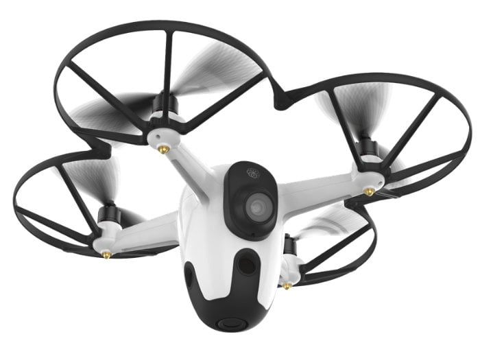
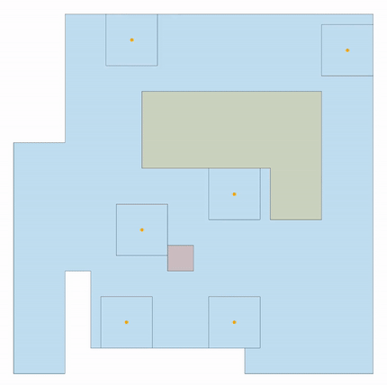

# A Distributed Approach to Interactive Surveillance Using a UAV Mounted Camera Network

Multi-Camera surveillance systems have become a modern trend in many fields both for research and for the industry. These systems are being increasingly used to enhance safety and security in public places such as parks, airports, and banks, as well as in restricted areas like government and military facilities. Furthermore, the possibility to mount cameras on Unmanned Aerial Vehicles (UAVs) extends the capabilities of these surveillance systems to a whole new level. Indeed, the employment of flying cameras allow for a substantial reconfigurability of the network and enable for new perspectives on the environment and wider coverage.

### Project Abstract
The aim of this project is to find a possible solution to the Interactive Surveillance problem using multiple UAV mounted cameras, from a top down perspective, in known environments. The coordinated patrolling problem is approached in a distributed fashion using a Bayesian-based Greedy algorithm with State Exchange. The results of this strategy are compared in restricted environments with the optimal paths obtained through linear programming. Furthermore, the overall performance is evaluated on large scale environments, where the optimal problem becomes infeasible. Kalman’s theory is employed to implement a smart target tracking algorithm with camera zoom control optimized for target containment and information loss minimization. Several simulations are performed tracking a target with different trajectory models and varying the sampling frequency of the filter and the accuracy of the detection. Finally, the robustness of such an algorithm to measurement errors and camera failures is put to the test.

For the technical results complete dissertation and the detailed description of the adopted strategies you can refer to the [Project Report :memo:](bargellesi_et_al_2020.pdf).

### Working Simulation
The results achieved with this project can be clearly appreciated in the following simulation. Indeed, the Interactive Sourveillance task performed by our UAV mounted camera system can be divided in 4 steps:
1. All the agents (:full_moon:) of the camera network patroll the environment sharing information to autonomously select the most suitable direction to follow
2. An intruder (:red_circle:) enters the environment and it is soon detected from one of our UAV cameras (:full_moon: -> :large_blue_circle:)
3. The camera begins the tracking task adjusting the zoom (:black_square_button: size) managing the tradeoff between tracking robustness and information gathering
4. On target loss the tracking camera returns to the tracking task (:large_blue_circle: -> :full_moon:), asking for the support of other UAVs in order to maximize the probability of tracking recovery

<p align="center">
  
</p>

### Project Organization
```
.
├── Data/                                       : Contains precompiled environments
├── src/                                        : Contains media resources
├── Camera.m                                    : Class defining a UAV camera object
├── Environment.m                               : Class defining the environment
├── BLP.m                                       : Routine to test the Binary Linear Programming solution to the patrolling problem
├── Optimal_zoom.m                              : Routine to test the smart zoom feature
├── SEBS.m                                      : Routine to test the distributed approach to the patrolling problem
├── Simulation.m                                : Routine to test the complete system on large scale environments
├── Simulation_preprocessing.m                  : Defines the Simulation parameters
├── Tracking_Control.m                          : Routine to test the UAV movement system during the tracking task
├── Tracking_indices.m                          : Routine to the tracking robustness
├── control.slx                                 : Simulink scheme for the UAV movement control system
├── envCell.m                                   : Function for environment cellularization
├── envEdges.m                                  : Function defining the allowed movement in the cellularized environment
├── getAllCycles.m                              : Function returning all possible simple cycles given a set of edges from a connected graph
├── getPID.p                                    : Private function returning the PID gains according to the Bode's method
├── getPID.m                                    : Header of getPID.p
├── kalman.m                                    : Function implementing the one step ahead Kalman filter
├── remapEdges.m                                : Function returning the set of edges associated to the connected components of a graph
├── splitCycles.m                               : Function splitting a cycle in all its sub-paths
├── bargellesi_et_al_2020.pdf                   : Project Report
└── README.md                                   : Project Summary 
```

#
_A work in collaboration with Luca Facin and Lorenzo Marchini._
